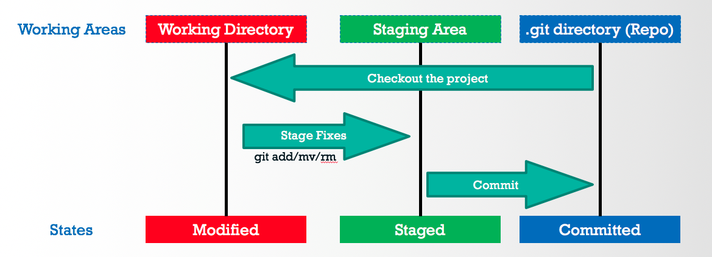

## git常用命令
初始化git仓库
```
git init
```
把文件添加进版本库
```
git add 1.txt
```
把文件提交到版本库
```
git commit -m 'add 1.txt'
```
> git add命令实际上就是把要提交的所有修改放到暂存区（Stage），然后，执行git commit就可以一次性把暂存区的所有修改提交到分支


仓库当前的状态
```
git status
```
对比文件
```
git diff 1.txt
```
git status告诉你有文件被修改过，用git diff可以查看修改内容

回退
```
git reset --hard 3628164
```

你的每一次命令记录：
```
git reflog
```

## 名词解释


### 工作目录（Working Directory）
工作目录是我们常用的使用或修改代码的目录，它可以从 Git 仓库目录中 checkout 出特定的分支或者版本来使用。在工作目录的修改如果未添加到暂存区，那么该修改仍处在已修改状态。

### 暂存区（Staging Area）
当我们在工作目录中修改了文件，我们需要先将修改添加到暂存区。暂存区的修改就是已暂存状态。

### 版本库（Repository)  
Git 仓库目录就是真正存储和管理代码库的目录。提交修改到代码库本质上就是将暂存区的修改提交（commit）到代码库中。处在 Git 仓库目录中的修改就是已提交状态。

-----

撤销工作区的修改 (未 git add)
```
git checkout -- readme.txt
```
把暂存区的修改撤销掉（unstage），重新放回工作区
```
git reset HEAD file
```
-----
## git删除文件

```
$ git add c.txt
$ git commit -m 'ccc'
```
删除文件
```
rm c.txt
```
查看状态
```
$ git status
On branch master
Changes not staged for commit:
  (use "git add/rm <file>..." to update what will be committed)
  (use "git checkout -- <file>..." to discard changes in working directory)

        deleted:    c.txt

no changes added to commit (use "git add" and/or "git commit -a")
```
#### 第一种情况 恢复文件
```
git checkout -- c.txt
```
用版本库里的版本替换工作区的版本，无论工作区是修改还是删除，都可以“一键还原”。
#### 第二种情况 删除文件
```
$ git rm c.txt
rm 'c.txt'
$ git commit -m 'delete ccc'
```
-----
## git关联远程仓库
本地库关联远程库
```
git remote add git@server-name:path/repo-name.git
git push -u origin master
```
或者**先在github创建远程库，再克隆**

## 分支
```
$ git checkout -b dev         # -b 表示创建并切换 
#相当于 
#$ git branch dev
#$ git checkout dev
Switched to a new branch 'dev'

$ git branch
* dev
  master
```
提交文件
```
$ git add readme.txt 
$ git commit -m "branch test"
[dev fec145a] branch test
 1 file changed, 1 insertion(+)
```
切回master分支
```
$ git checkout master
Switched to branch 'master'
```
把dev分支的工作成果合并到master分支上：
```
$ git merge dev
Updating 5455087..000b3e7
Fast-forward
 d.txt | 5 +++++
 1 file changed, 5 insertions(+)
 create mode 100644 d.txt
```
删除刚才已经合并掉的分支
```
$ git branch -d dev
Deleted branch dev (was 000b3e7).
```
#### 解决冲突
创建分支，并添加改动
```
$ git checkout -b dev1
Switched to a new branch 'dev1'
$ vim e.txt
$ git add e.txt
warning: LF will be replaced by CRLF in e.txt.
The file will have its original line endings in your working directory.

$ git commit -m 'eeee'
[dev1 d4ea5ba] eeee
warning: LF will be replaced by CRLF in e.txt.
The file will have its original line endings in your working directory.
 1 file changed, 1 insertion(+)
 create mode 100644 e.txt

Administrator@USER-20150716IT MINGW64 ~/Desktop/git-test (dev1)
```
切回master分支，添加改动
```
$ git checkout master
Switched to branch 'master'
$ vim e.txt
$ git add e.txt
warning: LF will be replaced by CRLF in e.txt.
The file will have its original line endings in your working directory.
$ git commit -m 'EEEEEE'
[master 9460bc9] EEEEEE
warning: LF will be replaced by CRLF in e.txt.
The file will have its original line endings in your working directory.
 1 file changed, 1 insertion(+)
 create mode 100644 e.txt
```
合并分支
```
$ git merge dev1
Auto-merging e.txt
CONFLICT (add/add): Merge conflict in e.txt
Automatic merge failed; fix conflicts and then commit the result.

Administrator@USER-20150716IT MINGW64 ~/Desktop/git-test (master|MERGING)
```
合并失败，显示有冲突

解决冲突
```
$ git status
On branch master
You have unmerged paths.
  (fix conflicts and run "git commit")

Unmerged paths:
  (use "git add <file>..." to mark resolution)

        both added:      e.txt

no changes added to commit (use "git add" and/or "git commit -a")

Administrator@USER-20150716IT MINGW64 ~/Desktop/git-test (master|MERGING)
$ vim e.txt

Administrator@USER-20150716IT MINGW64 ~/Desktop/git-test (master|MERGING)
$ git add e.txt

Administrator@USER-20150716IT MINGW64 ~/Desktop/git-test (master|MERGING)
$ git commit -m 'fixed'
[master f2f7c5f] fixed
```
看分支合并图。
```
$ git log --graph --pretty=oneline --abbrev-commit
*   f2f7c5f fixed
|\
| * d4ea5ba eeee
* | 9460bc9 EEEEEE
|/
* 000b3e7 branch test
* 5455087 delete ccc
* a518d3c ccc
* 40a21d0 add b
* b3da758 mmmmm
* d831b45 44444
* 24adc79 33333
* e26fa96 11111

Administrator@USER-20150716IT MINGW64 ~/Desktop/git-test (master)
```
删除dev1分支
```
$ git branch -d dev1
Deleted branch dev1 (was d4ea5ba).
```
#### 分支管理策略
```
$ git merge --no-ff -m "merge with no-ff" dev
Merge made by the 'recursive' strategy.
 a.txt | 8 --------
 1 file changed, 8 deletions(-)

Administrator@USER-20150716IT MINGW64 ~/Desktop/git-test (master)
$ git log --graph --pretty=oneline --abbrev-commit
*   371111c merge with no-ff
|\
| * df12169 aaaa
|/
*   f2f7c5f fixed
|\
| * d4ea5ba eeee
* | 9460bc9 EEEEEE
|/
* 000b3e7 branch test
```
可以在合并时形成一个新的commit

#### bug分支处理

当前分支所做修改 未提交 ，需要切到另外一个分支  然后创建 bug分支 然后fix bug
怎么办呢？
```
$ git stash
Saved working directory and index state WIP on dev: 434a1c5 ====
HEAD is now at 434a1c5 ====
```
然后
```
$ git checkout master
Switched to branch 'master'

Administrator@USER-20150716IT MINGW64 ~/Desktop/git-test (master)
$ git checkout -b bug01
Switched to a new branch 'bug01'
```
在bug01分支 修改bug 完成后 合并到主分支

删除bug01分支

然后再切回最开始 未做commit 的那个分支
```
$ git stash list
stash@{0}: WIP on dev: 434a1c5 ====

Administrator@USER-20150716IT MINGW64 ~/Desktop/git-test
$ git stash apply stash@{0}
On branch dev
Changes to be committed:
  (use "git reset HEAD <file>..." to unstage)

        new file:   c.txt
        new file:   qqqqqqq
```

#### feature分支管理
每添加一个新功能，最好新建一个feature分支，在上面开发，完成后，合并，最后，删除该feature分支

-D 强制删除 未合并的分支
```
$ git branch -D feature01
Deleted branch feature01 (was 5754ea1).
```
-D 强制删除 未合并的分支

###多人协作
查看远程库的信息
```
$ git remote -v
origin  https://github.com/xxx/py3_scripts.git (fetch)
origin  https://github.com/xxx/py3_scripts.git (push)
```
本地推送到远程库
```
$ git push origin master
```
推送时，要指定本地分支

多人协作的工作模式通常是这样：

首先，可以试图用git push origin branch-name推送自己的修改；

如果推送失败，则因为远程分支比你的本地更新，需要先用git pull试图合并；

如果合并有冲突，则解决冲突，并在本地提交；

没有冲突或者解决掉冲突后，再用git push origin branch-name推送就能成功！

如果git pull提示“no tracking information”，则说明本地分支和远程分支的链接关系没有创建，用命令git branch --set-upstream branch-name origin/branch-name。

这就是多人协作的工作模式，一旦熟悉了，就非常简单。


### 标签管理

```
$ git tag v1.0

$ git tag
v1.0
```
默认标签是打在最新提交的commit上的

给历史commit 打标签
```
$ git log --pretty=oneline --abbrev-commit
34588d1 asd
7ecfc82 add c qqqqq
292fb0f fix bug 01

$ git tag 0.9 292fb0f

$ git show 0.9
commit 349986d5c8468ab489b8e0b2f6c504df9a881240
Merge: 371111c 1c693e3
Author: noops2ty <1406282384@qq.com>
Date:   Thu Mar 15 17:50:30 2018 +0800

    merged bug fix 101
```
删除标签
```
$ git tag -d 0.9
```
#### 小结
```
命令git push origin <tagname>可以推送一个本地标签；

命令git push origin --tags可以推送全部未推送过的本地标签；

命令git tag -d <tagname>可以删除一个本地标签；

命令git push origin :refs/tags/<tagname>可以删除一个远程标签。
```
### 忽略指定格式的文件
```
$ vim .gitignore

*.py

$ git add 1.py
The following paths are ignored by one of your .gitignore files:
1.py
Use -f if you really want to add them.
```
### 别名配置
```
$ git config --global alias.co checkout
$ git config --global alias.ci commit
$ git config --global alias.br branch
$ git config --global alias.lg "log --color --graph --pretty=format:'%Cred%h%Creset -%C(yellow)%d%Creset %s %Cgreen(%cr) %C(bold blue)<%an>%Creset' --abbrev-commit"
```
配置文件
```
.git/config

$ cat .gitconfig
[alias]
    co = checkout
    ci = commit
    br = branch
    st = status
[user]
    name = Your Name
    email = your@email.com
```


差不多就这些吧