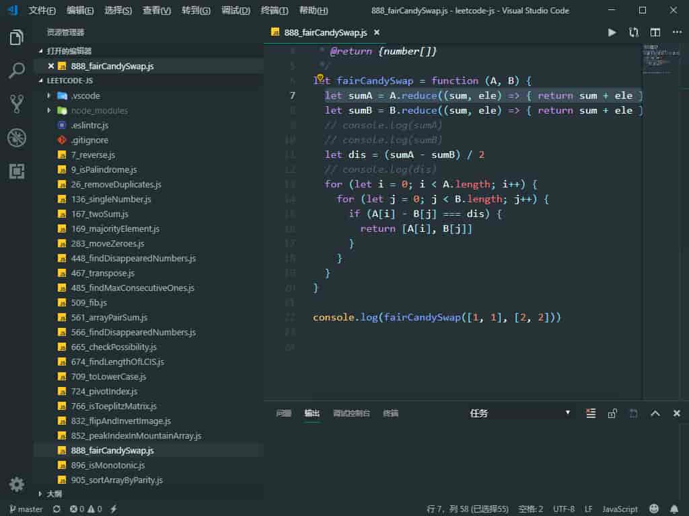

### 快捷键
#### 查看类或变量名的定义声明
**Ctrl+鼠标左键** 查看类或变量名的定义声明，看完之后我们想回到程序原来的位置，此时可以通过**Alt + ←**来返回到原来的位置。 
   
#### 下方插入空行不用到行尾回车换行
在行内任意位置都可以ctrl + enter  
#### 上方插入空行和上面的快捷键类似 
ctrl + shift + enter
#### 删除当前行
ctrl + shift + k

### 插件

### 主题
Atom Material Theme
### 图标
Material Icon Theme

